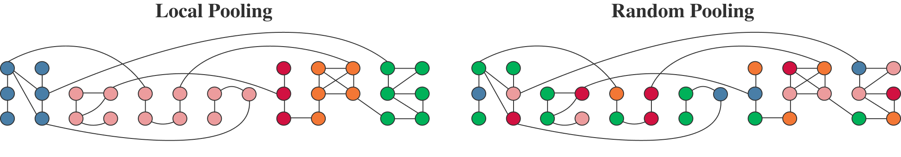

## Rethinking pooling in graph neural networks




This repo contains code for [Rethinking pooling in graph neural networks (NeurIPS 2020)](https://arxiv.org/abs/2010.11418).

In our work, we build upon representative GNNs ([Graclus](https://www.cs.utexas.edu/users/inderjit/public_papers/multilevel_pami.pdf), [DiffPool](https://arxiv.org/abs/1806.08804), [GMN](https://arxiv.org/abs/2002.09518), [MinCutPool](https://arxiv.org/abs/1907.00481)) and introduce variants that challenge the need for locality-preserving representations, either using randomization or clustering on the complement graph. Results show that using these variants does not result in any decrease in performance.

**Authors**:
- [Diego Mesquita](https://twitter.com/wkly_infrmtive) (diego.mesquita@aalto.fi) --- corresponding author.
- [Amauri H. Souza](http://www.amauriholanda.org/) 
- [Sami Kaski](https://people.aalto.fi/samuel.kaski)

#### Requirements
We have built this implementation using:
- PyTorch v1.4.0
- PyTorch Geometric v1.4.3
- OGB v1.2.1 


#### Usage

There is a folder and a main file for each model (*diffpool*, *gmn*, *graclus* and *mincut*). As an example, the code below runs Graclus and its non-local variant (Complement) on NCI1:  
```
$ python main_graclus.py --dataset NCI1 --reproduce --pooling_type graclus
$ python main_graclus.py --dataset NCI1 --reproduce --pooling_type complement
```

Each main file includes optional arguments.

#### Cite
```
@inproceedings{rethinkpooling2020,
  title={Rethinking pooling in Graph Neural Networks},
  author={D. Mesquita and A. H. Souza and S. Kaski},
  booktitle={Advances in Neural Information Processing Systems (NeurIPS)},
  year={2020}
}
```

#### Acknowledgement
To avoid implementation biases, we have closely followed available code. In doing so, we have either re-used or modified code from [gnn-comparison](https://github.com/diningphil/gnn-comparison), [pytorch-geometric](https://github.com/rusty1s/pytorch_geometric), and [benchmarking-gnns](https://github.com/graphdeeplearning/benchmarking-gnns).
